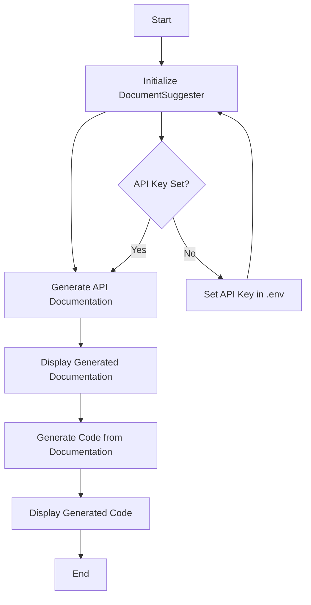

# D2C_C2D

DocumentSuggester is a Python tool that leverages the Anthropic API to generate API documentation from code and vice versa. This tool is perfect for developers who want to streamline their documentation process or quickly generate code skeletons from existing documentation.

## Flowchart



## Setup Instructions

1. **Clone the Repository**
   ```
   git clone https://github.com/ByungHeonLEE/d2c_c2d.git
   cd code
   ```

2. **Set Up a Virtual Environment** (Optional but recommended)
   ```
   python -m venv venv
   source venv/bin/activate  # On Windows, use `venv\Scripts\activate`
   ```

3. **Install Required Packages**
   ```
   pip install -r requirements.txt
   ```

4. **Set Up Environment Variables**
   - Create a `.env` file in the project root directory
   - Add your Anthropic API key to the `.env` file:
     ```
     ANTHROPIC_API_KEY=your_api_key_here
     ```

## Usage

1. **Run the Script**
   ```
   python code_to_docu.py
   ```

2. **View the Output**
   - The script will generate API documentation for the sample code
   - It will then generate new code based on the documentation
   - Both outputs will be displayed in the console

## Customization

- Modify the `sample_code` in `main()` to generate documentation for your own code
- Adjust the `max_tokens` and `temperature` parameters in the API calls to fine-tune the output

## Troubleshooting

- If you encounter any errors related to the API key, ensure it's correctly set in the `.env` file
- For other issues, check the Anthropic API documentation or open an issue in this repository


## License

This project is licensed under the MIT License - see the LICENSE file for details.
